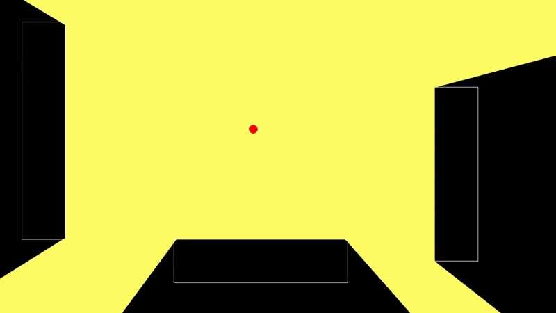

<h1 align="center">
    Python-Raycasting
</h1>

&nbsp;&nbsp;&nbsp;&nbsp;

<div align="center">
  <kbd>
    
  </kbd>
</div>

&nbsp;&nbsp;&nbsp;&nbsp;

<h4 align="center">
    A simulation of the fundemental concept to build raytracing using segmented raycasting. Due to the low amount of blocks that light can collide with the most effective calculation would be to use 1 ray segment and get all collitions but this project was built to experiment with the possibility of more complex shapes with large amount of verticies. This project uses the CPU for calculating rays and collitions and is not optimized to be used directly in games.
</h4>

## How to simulate

### Install dependencies

#### Windows
```bash
pip install -r requirements.txt
```

#### Linux / Mac
```bash
pip3 install -r requirements.txt
```

### Run src/main.py

#### Windows
```bash
python src/main.py
```

#### Linux / Mac
```bash
python3 src/main.py
```
